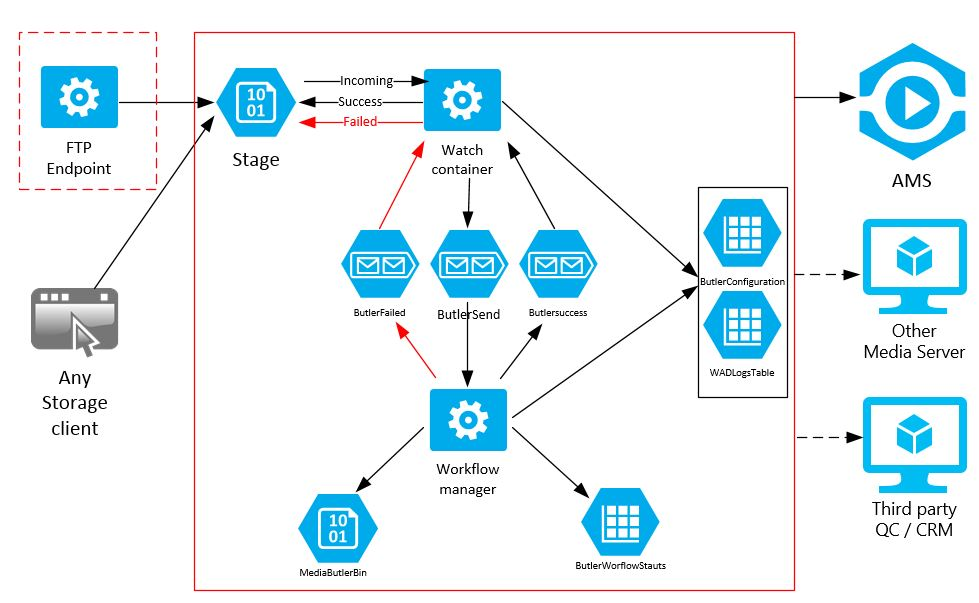

<h2>Introduction</h2>
<b>Media Butler framework </b> is a VOD workflow automation framework for Azure Media Services. It support create different workflow using configuration, combining pre-defined steps or using customs steps create by code.
The basic workflow implementation is a folder watch folder but you can automate more complex scenarios like AMS replication cross regions.

Media butler is composed by 2 workers roles: Watcher and Workflow role. First one take the new files and submit it to Workflow Manager  by ButlerSend Queue. When a new job is summited, this role move the original files form Incoming folder to Processing.   Once the process finish, success or fail, this role receive a message and process it. If the process was success, it will move the original date from Processing to Success folder. In the fail case, will move to Fail folder.

Workflow Manager is Media Butler's core, it is the workflow coordinator. It receives jobs from ButlerSend queue, and process it following the process definition in ButlerConfiguration table. This role, follow and control the process and execute each step. When the process finish, it sends the notification as is configured. 

This version has this process steps ready to use:

1.	Select AMS account: you can select in each process which  AMS account you want to use.
2.	Ingest mezzanine files:  one or more mezzamine files, MP4 and json files with parameters for the process.
3.	Standard encoder: using AMS encoder with preset or custom xml encoding profiles
4.	Package: existing MP4 for streaming, you don’t need to re-encode if you have ready your M4P files.
5.	Index: indexing video asset, it generates  Closed caption file in SAMI format,  Closed caption file in Timed Text Markup Language (TTML) format,  Keyword file (XML),  Audio indexing blob file (AIB) for use with SQL server
6.	Clipping: Create/update  ISMF files  for clipping
7.	Delete original mezzanine files
8.	Create streaming Locator
9.	Create SaS locator
10.	Queue Notification
11.	Mail Notification
12.	Blob text Notification
13.	Replica: replicate videos from one AMS to another AMS for HA deployments

  

 <h2>How to deploy Media Butler Framework</h2>
  <h3>Setup pre requisites</h3>

  1. Azure Subscription
  2. Azure Media Services Name and Key
  3. Empty Azure Storage Account Name for Media Butler Framework
  4. [Optional] SendGrid account

  <h3>Deploy Media Butler all in one</h3>
  Media Butler Framework (MBF) has a deployment PowerShell <a href="./MediaButlerDeploy.ps1">script</a>. This script deploy MBF in the All in one deployment and create a basic process, ready to use. This basis process´s steps are:

  1. Ingest the mezzanine file
  2. Encode using default profile
  3. Delete the original mezzanine asset
  4. Create a Streaming locator
  5. Create a SAS Locator
  6. Write the process output info in the LOG file

You only need to setup this variable

a. $azureSubscriptionName: Azure subscription name 
b. $butlerStorageAccountName: Butler's storage account name 
c. $MediaServiceAccountName: AMS account name 
d. $PrimaryMediaServiceAccessKey: AMS access Key 
e. $MediaStorageConn: AMS storage account connection string 
f. $SendGridStepConfig: Options, if you want to use SendGrid Mail Notification yo need to add your step configuration here. 
g. $serviceName: Cloud Services Name for Media Butler 
h. $slot="Production" 
i. $serviceLocation: Cloud Services Location, it must be in the same AMS's location 

Execute the script, and that is!

<h3>Test the deployment process </h3>
  
1. Upload MP4 for “testbasicprocess” container in “Incoming” folder.
2. Check in Media Services content a new asset with pattern name “testbasicprocess_[your MP4 video Name]_Butler_[GUID]”
3. Check in Media Services JOB list a new job
4. When the job finish, check the  final asset Encoded and published with the patter name “testbasicprocess_[your MP4 video Name]__Butler_[GUID]_mb”
5. Now, your could go to the Media Butler Storage, and review the output info in the file  testbasicprocess/Completed/_[your MP4 video Name].[date and time].log

  <h3>More information</h3>
  1. <a href="">Intoduction to Azure Media Butler Framework</a>
  2. <a href="./docs/HowToDeploy.html">How to Deploy and customize the VOD process</a>