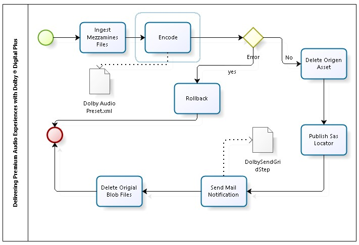

<h1 id="automation-of-delivering-premium-audio-experiences-with-dolby-digital-plus-in-azure">Automation of Delivering Premium Audio Experiences with Dolby Digital Plus in Azure</h1>

Dolby Digital Plus is an advanced surround sound audio technology that's built into home theaters, smartphones, operating systems, and browsers. More information <a href="http://www.dolby.com/us/en/technologies/dolby-digital-plus.html">here</a>.

Azure Media Services Encoder support use Dolby Plus encode for produce premium audio experience with your content. <a href="http://azure.microsoft.com/blog/2014/09/03/delivering-premium-audio-experiences-with-dolby-digital-plus/">Here</a> you have a detail post about how it work this encoder with Media Services.

Here we will do a Media Butler Framework configuration to automate the VOD process and use this encoder to transcode the audio. Butler does process automation, you can see more info <a href="http://aka.ms/mediabutlerframework">here</a>.

The process to configure is showed in the following diagram and the whole process uses Media Butler Framework standard steps. You do not need to do custom code to use this encoder, only write the right configuration.

<h2 id="azure-media-butler-dolby-digital-plus-vod-process-has-6-steps">Azure Media Butler Dolby Digital Plus VOD process has 6 steps:</h2>
<ol style="list-style-type: decimal">
<li>
<strong>Ingest Mezzanine Files:</strong> Read all files from the staging container and ingest in a new Asset.
</li>
<li>
<strong>Encode:</strong> Encode the video asset using the Media Services Encoder with custom Encoder Audio Preset.
</li>
<li>
<strong>Delete the original Asset:</strong> delete mezzanine files assets.
</li>
<li>
<strong>Publish SAS Locator:</strong> Locator provides an entry point to access the files contained in an Asset, here you create one<strong>.</strong>
</li>
<li>
<strong>Send Mail Notification:</strong> Using Send Grid services, send the output process information notification.
</li>
<li>
<strong>Delete Original Blob Files</strong>: clean the Stage Blob container.
</li>
</ol>
<h2 id="create-a-new-process">Create a new process</h2>

To setup a new process on Butler you need to create a staging blob container and add the process configuration. Follow this step by step sample.

<ol style="list-style-type: decimal">
<li>
Create a new staging blob storage container.

Example: <strong>my<em>dolby</em></strong> <em>blob container</em>.
</li>
<li>
<strong>Add the process configuration</strong>.

Insert a configuration record in <strong>ButlerConfiguration</strong> Table Storage with this data

Example:

<ol style="list-style-type: lower-alpha">
<li>
<em><strong>PartitioKey</strong>: MediaButler.Common.workflow.ProcessHandler</em>
</li>
<li>
<em><strong>RowKey</strong>: <strong>mydolby</strong>.ChainConfig</em>
</li>
<li>
<em><strong>ConfigurationValue</strong>:</em>
</li>
</ol></li>
</ol>
<blockquote>

<em>[</em>

<em>{&quot;AssemblyName&quot;:&quot;MediaButler.BaseProcess.dll&quot;,&quot;TypeName&quot;:&quot;MediaButler.BaseProcess.MessageHiddeControlStep&quot;,&quot;ConfigKey&quot;:&quot;&quot;},</em>

<em>{&quot;AssemblyName&quot;:&quot;MediaButler.BaseProcess.dll&quot;,&quot;TypeName&quot;:&quot;MediaButler.BaseProcess.IngestMultiMezzamineFilesStep&quot;,&quot;ConfigKey&quot;:&quot;&quot;},</em>

<em>{&quot;AssemblyName&quot;:&quot;MediaButler.BaseProcess.dll&quot;,&quot;TypeName&quot;:&quot;MediaButler.BaseProcess.StandarEncodeStep&quot;,&quot;ConfigKey&quot;:&quot;<strong>DolbyAudioPreset</strong>&quot;},</em>

<em>{&quot;AssemblyName&quot;:&quot;MediaButler.BaseProcess.dll&quot;,&quot;TypeName&quot;:&quot;MediaButler.BaseProcess.DeleteOriginalAssetStep&quot;,&quot;ConfigKey&quot;:&quot;&quot;},</em>

<em>{&quot;AssemblyName&quot;:&quot;MediaButler.BaseProcess.dll&quot;,&quot;TypeName&quot;:&quot;MediaButler.BaseProcess.CreateSasLocatorStep&quot;,&quot;ConfigKey&quot;:&quot;&quot;},</em>

<em>{&quot;AssemblyName&quot;:&quot;MediaButler.BaseProcess.dll&quot;,&quot;TypeName&quot;:&quot;MediaButler.BaseProcess.SendGridStep&quot;,&quot;ConfigKey&quot;:&quot;<strong>DolbySendGridStep</strong>&quot;},</em>

<em>{&quot;AssemblyName&quot;:&quot;MediaButler.BaseProcess.dll&quot;,&quot;TypeName&quot;:&quot;MediaButler.BaseProcess.DeleteOriginalBlobStep&quot;,&quot;ConfigKey&quot;:&quot;&quot;},</em>

<em>{&quot;AssemblyName&quot;:&quot;MediaButler.BaseProcess.dll&quot;,&quot;TypeName&quot;:&quot;MediaButler.BaseProcess.MessageHiddeControlStep&quot;,&quot;ConfigKey&quot;:&quot;&quot;}</em>

<em>]</em>

</blockquote>
<ol style="list-style-type: decimal">
<li>
Create XML encoder preset and upload to <strong>mediabulterbin</strong> container

The preset is a XML file, following the example use the name <strong>myDolbyPreset.xml</strong>
</li>
<li>
Add <strong>StandarEncodeStep</strong> configuration

Insert a configuration record in <strong>ButlerConfiguration</strong> Table Storage with this data

Example:

a. <strong>PartitioKey</strong>: MediaButler.Common.workflow.ProcessHandler

b. <strong>RowKey</strong>: <em>DolbyAudioPreset.StepConfig</em>

c. <strong>ConfigurationValue</strong>: <em><strong>myDolbyPreset.xml</strong></em>

The content of <strong>myDolbyPreset.xml</strong> is

&lt;?xml version=&quot;1.0&quot; encoding=&quot;utf-16&quot;?&gt;

&lt;Presets&gt;

&lt;Preset

Version=&quot;5.0&quot;&gt;

&lt;MediaFile

DeinterlaceMode=&quot;AutoPixelAdaptive&quot;

ResizeQuality=&quot;Super&quot;

VideoResizeMode=&quot;Stretch&quot;&gt;

&lt;OutputFormat&gt;

&lt;MP4OutputFormat

StreamCompatibility=&quot;Standard&quot;&gt;

&lt;VideoProfile&gt;

&lt;MainH264VideoProfile

BFrameCount=&quot;3&quot;

EntropyMode=&quot;Cabac&quot;

RDOptimizationMode=&quot;Speed&quot;

HadamardTransform=&quot;False&quot;

SubBlockMotionSearchMode=&quot;Speed&quot;

MultiReferenceMotionSearchMode=&quot;Balanced&quot;

ReferenceBFrames=&quot;False&quot;

AdaptiveBFrames=&quot;True&quot;

SceneChangeDetector=&quot;True&quot;

FastIntraDecisions=&quot;False&quot;

FastInterDecisions=&quot;False&quot;

SubPixelMode=&quot;Quarter&quot;

SliceCount=&quot;0&quot;

KeyFrameDistance=&quot;00:00:02&quot;

InLoopFilter=&quot;True&quot;

MEPartitionLevel=&quot;EightByEight&quot;

ReferenceFrames=&quot;4&quot;

SearchRange=&quot;64&quot;

AutoFit=&quot;True&quot;

Force16Pixels=&quot;False&quot;

FrameRate=&quot;0&quot;

SeparateFilesPerStream=&quot;True&quot;

SmoothStreaming=&quot;False&quot;

NumberOfEncoderThreads=&quot;0&quot;&gt;

&lt;Streams

AutoSize=&quot;False&quot;

FreezeSort=&quot;False&quot;&gt;

&lt;StreamInfo

Size=&quot;1280, 720&quot;&gt;

&lt;Bitrate&gt;

&lt;ConstantBitrate

Bitrate=&quot;4500&quot;

IsTwoPass=&quot;False&quot;

BufferWindow=&quot;00:00:05&quot; /&gt;

&lt;/Bitrate&gt;

&lt;/StreamInfo&gt;

&lt;/Streams&gt;

&lt;/MainH264VideoProfile&gt;

&lt;/VideoProfile&gt;

<strong>&lt;AudioProfile&gt;</strong>

<strong>&lt;DolbyDigitalPlusAudioProfile</strong>

<strong>Codec=&quot;DolbyDigitalPlus&quot;</strong>

<strong>EncoderMode=&quot;DolbyDigitalPlus&quot;</strong>

<strong>AudioCodingMode=&quot;Mode32&quot;</strong>

<strong>LFEOn=&quot;True&quot;</strong>

<strong>SamplesPerSecond=&quot;48000&quot;</strong>

<strong>BandwidthLimitingLowpassFilter=&quot;True&quot;</strong>

<strong>DialogNormalization=&quot;-31&quot;&gt;</strong>

<strong>&lt;Bitrate&gt;</strong>

<strong>&lt;ConstantBitrate</strong>

<strong>Bitrate=&quot;512&quot;</strong>

<strong>IsTwoPass=&quot;False&quot;</strong>

<strong>BufferWindow=&quot;00:00:00&quot; /&gt;</strong>

<strong>&lt;/Bitrate&gt;</strong>

<strong>&lt;/DolbyDigitalPlusAudioProfile&gt;</strong>

<strong>&lt;/AudioProfile&gt; </strong>

&lt;/MP4OutputFormat&gt;

&lt;/OutputFormat&gt;

&lt;/MediaFile&gt;

&lt;/Preset&gt;

&lt;/Presets&gt;
</li>
<li>
Add <strong>DolbySendGridStep</strong> configuration

Insert a configuration record in <strong>ButlerConfiguration</strong> Table Storage with this data

Example:

a. <strong>PartitioKey</strong>: MediaButler.Common.workflow.ProcessHandler

b. <strong>RowKey</strong>: <em><strong>DolbySendGridStep</strong>.StepConfig</em>

c. <strong>ConfigurationValue</strong>:

<em>{</em>

<em>&quot;UserName&quot;:&quot;[your user account]&quot;,</em>

<em>&quot;Pswd&quot;:&quot;[upy password]&quot;,</em>

<em>&quot;To&quot;:&quot;[to mail]&quot;,</em>

<em>&quot;FromName&quot;: &quot;Butler Media Framework: Dolby&quot;,</em>

<em>&quot;FromMail&quot;: &quot;butler@XXX.com&quot; </em>

<em>}</em>
</li>
<li>
Update <strong>ContainersToScan</strong> record in <strong>ButlerConfiguration</strong> storage Table, adding the new container.

Example:
</li>
</ol>
<ul>
<li>
<em><strong>PrimaryKey</strong>: MediaButler.Workflow.WorkerRole</em>
</li>
<li>
<em><strong>RowKey</strong>: ContainersToScan</em>
</li>
<li>
<em><strong>ConfigurationValue</strong>: testbasicprocess, testpremiunencoder,<strong>mydolby</strong></em>
</li>
</ul>
<ol style="list-style-type: decimal">
<li>
Restart <strong>Watcher</strong> Role from Media Butler Framework
</li>
</ol>
<h2 id="testing-the-process">Testing the process</h2>

To test the new process you need the following:

<ul>
<li>
A sample video (mezzanine video file) to upload. (i.e an MP4 file) You can <a href="http://d28c.wpc.azureedge.net/80D28C/amsorigin/e1893d2b-6a8c-4603-864c-0ed95a7cf42d/Silent_1920x1080_51AAC.mp4">download the source MP4</a> file here to use in your own testing.
</li>
<li>
You must upload the video file in the Media Butler “Incoming” blob folder.
</li>
</ul>

Now follow these steps:

<ol style="list-style-type: decimal">
<li>
Create a Blob folder container Incoming
</li>
<li>
Upload the video Mezzanine file blob storage container “<strong>Incoming</strong>”
</li>
<li>
Check the new Assets and jobs created in AMS
</li>
<li>
Wait to finish the transcoding process
</li>
<li>
At the end of the process, you will receive a notification email like this:
</li>
</ol>
<blockquote>

</blockquote>
<h2 id="related-content">Related content</h2>
<ul>
<li>
<a href="https://github.com/liarjo/MediaBlutlerTest01/blob/master/README.md">Media Butler Framework repository</a>
</li>
</ul>
