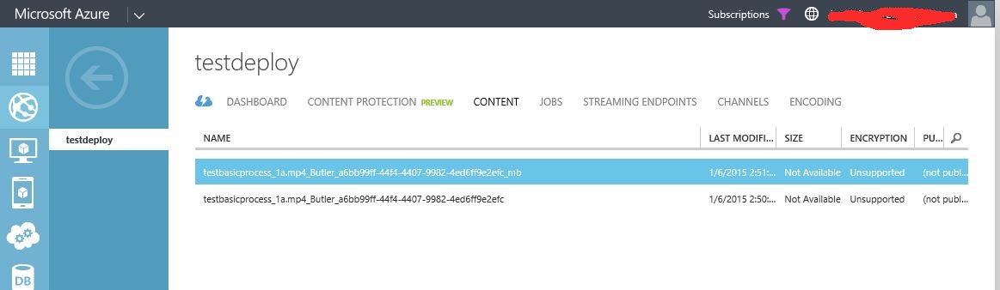
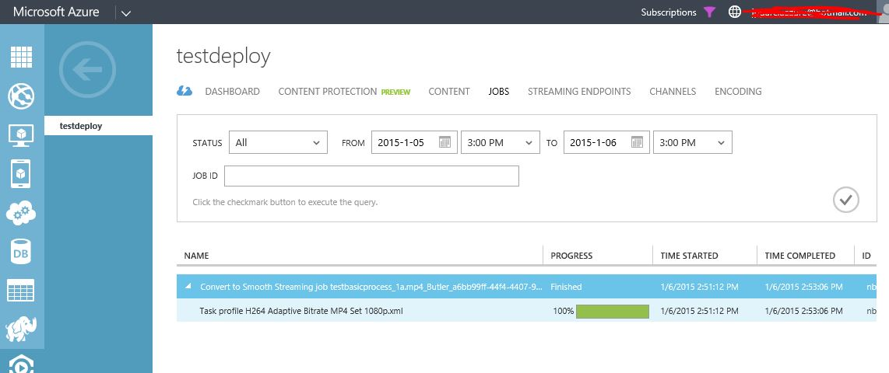
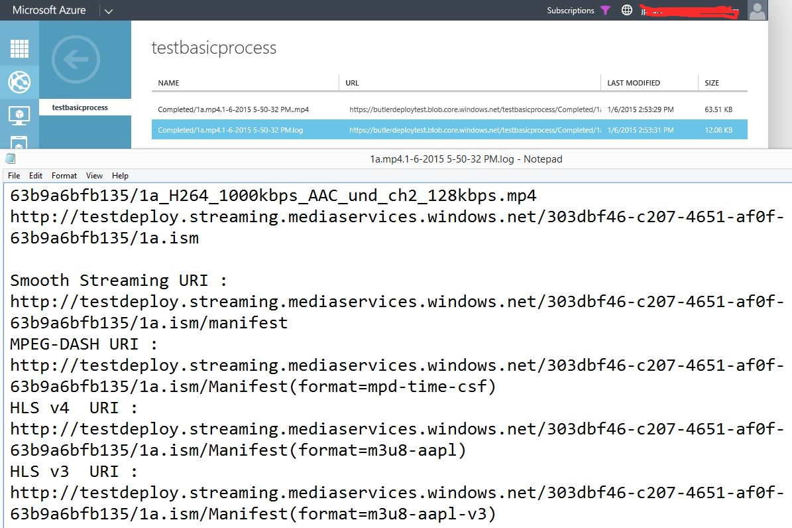

<h1 class="auto-style1">How to deploy Media Butler Framework</h1>
<h2 class="auto-style1">Deploy Overview</h2>

This blog post explain how to deploy and test a basic VOD process using Media Butler Framework. It is compose by one cloud services with 2 workers roles: Watcher and Workflow role. First one take the new files and submit it to Workflow Manager by ButlerSend Queue. When a new job is summited, this role move the original files form Incoming folder to Processing. Once the process finish, success or fail, this role receive a message and process it. If the process was success, it will move the original date from Processing to Success folder. In the fail case, will move to Fail folder.

<h2 class="auto-style1">Setup pre requisites</h2>
<ul>
    <li>Azure Subscription</li>
    <li>Azure Media Services Name and Key<ul>
        <li>One or more Streaming Endpoints reserv units for dynamic package</li>
        </ul>
    </li>
    <li>Empty Azure Storage Account Name for Media Butler Framework</li>
    <li>[Optional] SendGrid account</li>
</ul>
<h2 class="auto-style1">Deploy Media Blutler and default VOD process</h2>

    
    <strong>Media Butler Framework</strong> (MBF) has a deployment PowerShell script. This script deploy MBF in the All in one deployment and create a basic process, ready to use. 
 

    
    This basis process´s steps are:
 

<ol>
    <li>Ingest the mezzanine file</li>
    <li>Encode using default profile</li>
    <li>Delete the original mezzanine asset</li>
    <li>Create a Streaming locator</li>
    <li>Create a SAS Locator</li>
    <li>Write the process output info in the LOG file</li>

 </ol>

    You only need to setup this variable:

<ul>
    <li><strong>$azureSubscriptionName</strong>: Azure subscription name </li>
    <li><strong>$butlerStorageAccountName</strong>: Butler's storage account name </li>
    <li><strong>$MediaServiceAccountName</strong>: AMS account name </li>
    <li><strong>$PrimaryMediaServiceAccessKe</strong>y: AMS access Key</li>
    <li><strong>$MediaStorageConn</strong>: AMS storage account connection string </li>
    <li><strong>$SendGridStepConfig</strong>: Options, if you want to use SendGrid Mail Notification yo need to add your step configuration here. </li>
    <li><strong>$serviceName</strong>: Cloud Services Name for Media Butler </li>
    <li><strong>$slot</strong>="Production" </li>
    <li><strong>$serviceLocation:</strong> Cloud Services Location, it must be in the same AMS's location </li>
</ul>
Execute the script, and that is!
<h2 class="auto-style1">Deployment Check</h2>

    Deployment process create a basic VOD process in Bulter, you can check the deployment using this process. The validations steps are:

<ol>
    <li>Using any Storage tool go to Butler Storage and looking for the &quot;testbasicprocess&quot; container</li>
    <li>Create &quot;Incoming&quot; blob folder inside &quot;testbasicprocess&quot; container</li>
    <li>Upload a mezamine MP4 file to this container</li>
    <li>Go to AMS content page and wait for the new content in the list  
          
    </li>
    <li>Now, you can see AMS&#39;s job list and see your encoding Job  
          
    </li>
    <li>After Job finish, came back to the content and see the publishet asset using the play button.</li>
    <li>As default output of the process you have a LOG file with all the new asset information.You can find the LOG in Butler storage account, &quot;testbasicprocess&quot; container.  
          
    </li>

</ol>

    &nbsp;

