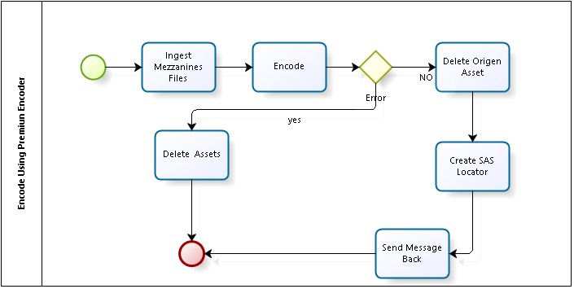

<h1>Automation of Premium Encoding in Azure Media Services with Media Butler</h1>
<h2>Introduction</h2>
You can review AMS Premium Encoder documentation <a href="http://azure.microsoft.com/blog/2015/03/05/introducing-premium-encoding-in-azure-media-services/">here</a>
 and AMS Explorer to submit premium encoder task <a href="http://azure.microsoft.com/blog/2015/03/06/how-to-use-premium-encoding-in-azure-media-services/">here</a>.

Pre-requisite: You have to have Azure Media Butler already deployed to use this capability.  <a href="https://github.com/liarjo/MediaBlutlerTest01/blob/master/README.md">Here</a> is the link on how to deploy the media butler framework.

This document describes how to implement a VOD automation process with Azure Media Butler to encode videos using Azure Media Services premium Encoder. The process is triggered based on a watch folder pattern. If you upload a video and a workflow encode definition file, Media Butler will encoded it and send a notification.

The process is shown in the following diagram.

Azure Media Butler VOD process has 5 steps:
<ol>
	<li><b>Ingest Mezzanine File(s)</b>: Read all file(s) from the staging container and ingest in a new Asset. </li>
	<li><b>Encode:</b> Encode the video asset using the premium workflow definition.</li>
	<li><b>Delete the original Asset:</b> delete mezzanine file(s) and Workflow file asset(s).</li>
	<li><b>Process end notification:</b> send the process output log to Complete Blob Container (Complete BLOB container is a storage location for output files).</li>
</ol>

Azure Media Butler Framework can process multiple files in parallel, you only need to define the process in the configuration table.  Now we will setup the process illustrated in the previous diagram by adding a configuration file in json format.

<h2>Related content</h2>
<li><a href="https://github.com/liarjo/MediaBlutlerTest01/blob/master/README.md">Media Butler Framework repository</a></li>
<li><a href="https://github.com/liarjo/MediaBlutlerTest01/blob/master/docs/HowToDeploy.md">How to deploy</a></li>